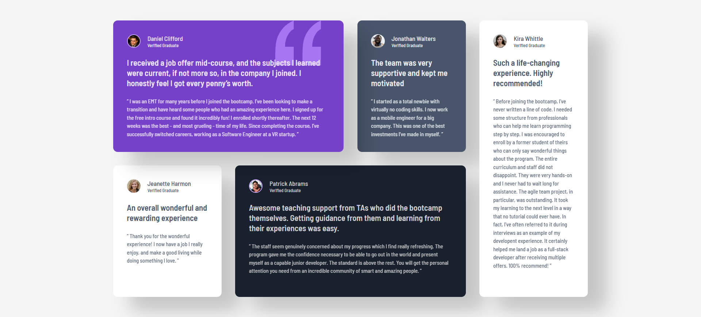

# Frontend Mentor - Testimonials grid section solution

This is a solution to the [Testimonials grid section challenge on Frontend Mentor](https://www.frontendmentor.io/challenges/testimonials-grid-section-Nnw6J7Un7). Frontend Mentor challenges help you improve your coding skills by building realistic projects.

## Table of contents

- [Overview](#overview)
  - [The challenge](#the-challenge)
  - [Screenshot](#screenshot)
  - [Links](#links)
- [My process](#my-process)
  - [Built with](#built-with)
  - [What I learned](#what-i-learned)
  - [Continued development](#continued-development)
  - [AI Collaboration](#ai-collaboration)


## Overview

### The challenge

Users should be able to:

- View the optimal layout for the site depending on their device's screen size

### Screenshot




### Links

- Live Site URL: https://lenka-limberkova.github.io/testimonials-grid-section/

## My process

### Built with

- Semantic HTML5 markup
- CSS custom properties
- Flexbox
- CSS Grid

### What I learned

In this project I reinforced and deepened my understanding of CSS Grid - specifically how to use `grid-column` and `grid-row` with `span` values to create an irregular mosaic of differently sized cards within a single grid:

```css
.box1 {
  grid-column: 1 / span 2;
}

.box5 {
  grid-row: 1 / span 2;
  grid-column: 4 / span 1;
}
```

An important takeaway was how `position: absolute` behaves in combination with `position: relative` on a parent element. To place the quotation icon precisely in the top-right corner of the card, and keep it there regardless of the card's size, I needed to set `position: relative` on the parent (turning it into an "anchor") and `position: absolute` on the icon with `top` and `right`:

```css
.box1 {
  position: relative;
}

.quotation-icon {
  position: absolute;
  top: 24px;
  right: 24px;
}
```

I also learned that `box-shadow` has a real "reach" determined by the sum of its offset, blur, and spread values - which can cause one card's shadow to overlap a neighboring card if the grid gap (`row-gap`/`column-gap`) is smaller than that reach.

### Continued development

I want to keep working on:

- responsive design with media queries (switching from the grid layout to a single-column mobile layout)
- building a deeper understanding of CSS Grid and Flexbox so I can combine them more effectively
- gradually moving from static websites toward JavaScript and SQL

### AI Collaboration

I used Claude (Anthropic) as a consultant for solving specific CSS problems during this project.

- How I used it: getting explanations for why the layout broke with `position: fixed` vs. `absolute`/`relative`, fixing a `box-shadow` overlapping between cards, and working out an approach for mobile-first responsiveness with media queries.
- What worked well: breaking down *why* the behavior happened (e.g. that an absolutely positioned element is placed relative to the nearest ancestor with a `position` other than `static`), which helped me understand the problem instead of just copying a fix.
- Approach: I always asked for the underlying principle and the available options with their pros/cons first, then wrote the code changes myself so I'd stay in control of them.

